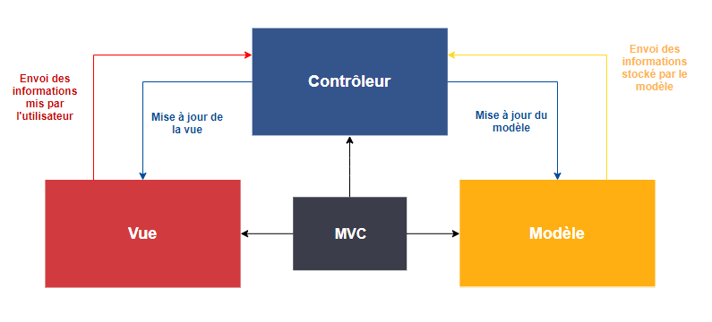

# ISI3 - MVP design pattern - "Game of Life"

> Le rapport est à fournir dans ce document sous chacune des questions.
> **Ne restez pas bloqués bêtement, demander de l'aide**
> Ne copier pas le code de votre voisin, ça se voit.

Nom/Prénom: `VIRARAGAVANE Smaïline`

Lien du codesandbox: `https://codesandbox.io/s/adoring-platform-wnyct?file=/index.html`

> Pour générer un codesandbox associé à votre code, [suiver cette doc](https://codesandbox.io/docs/importing#import-from-github)

## Game of Life

Le jeu de la vie est un automate cellulaire qui répond à des règles très simple.
Il est inventé par [John Horton Conway](https://fr.wikipedia.org/wiki/John_Horton_Conway)(1937-2020).

## Avant-propos

1. Expliquer le design pattern MVC à l'aide d'un schéma à insérer directement ici.
   Utiliser un outils commde Dia pour le représenter. Je veux **votre** schéma, pas un de ceux qu'on peut trouver sur le net.
   
   
   
   Comme nous pouvons le voir dans le schéma, le pattern MVC est composé de 3 entités : le contrôleur, la vue et le modèle.
   Ces trois couches sont distinctes et permettent de séparer le code de manière à avoir un code modulable. En effet, 
   chaque entité à sa propre fonction.
   
   - La vue : elle regroupe tout ce qui concerne le visuel de l'application c'est-à-dire la page web, l'interface ... 
   tout les éléments qui interagissent directement avec l'utilisateur.
   
   - Le contrôleur : Il permet de récupérer les informations mis dans la vue, permet de contrôler les informations saisies,
   les ajouter dans le modèle afin de mettre à jour les données. Il peut récupérer les données du modèle afin de les 
   transmettre à la vue pour éventuellement affiché des enregistrements déjà effectués. 
   
   - Le modèle : c'est celui qui contient toutes les données de l'application. Il peut être représenter par des objets qui
   contient leur propre informations via un accès à la base de données afin de mettre à jour leurs informations.
   
2. Expliquer ce pattern à l'aide en complétant ce texte.

Le pattern MVP, vise à découper le `modèle`, de la `vue` et du `controleur` afin de rendre le code plus `modulable`.
Les responsabilités ne sont alors plus `dépendantes`.
On peut ainsi changer l'aspect visuel de son application sans pour autant impacter le `modèle`.

3. Expliquer dans quels cas on doit privilégier le pattern MVC.

Nous pouvons utiliser le pattern MVC lorsque qu'une application possède des données, une interface graphique. Ainsi pour
partager le code en 3 parties afin de bien délimiter chaque fonction. Ainsi pour avoir un meilleur maintenabilité et avoir 
un code modulable, le MVC devient donc dans ce cas là une solution.  

## A faire (obligatoire)

- Render le jeu fonctionel tout en respectant le design pattern MVC.
- Le bouton `start` doit lancer le jeu.
- Le bouton `stop` doit arrêter le jeu en l'état, le `start` relance le jeu.
- le bouton `reset` arrête le jeu et vide remet à la grille à l'état initiale.

### Observer Observable

Afin de mettre à jour la vue à chaque nouvelle génération du jeu, la fonction `updated` doit notifier la view afin qu'elle se mette à jour.
En quoi cela relève du design pattern ObserverObservable.

1. Expliquer votre implémentation:

L'usage d'une callback permet ici de `signaler` afin dire à la _View_ de se redessiner.
L'objet _Model_ n'a pas de lien avec `la vue` pourtant grâce à la `callback` il peut notifier la `vue`.

2. Insérer ici un UML montrant le pattern Observer-Observable liés aux objects de ce TP.
 

## Optionel

> Si vous voulez apprendre d'autres choses

- Faire sorte de pouvoir changer les dimensions de la grille par in `<input/>` HTML.
- Faire en sorte de pouvoir modifier l'état d'une cellule en cliquant dessus.

## :warning: À rendre

- Une URL de codesandox pointant sur votre projet github afin que je puisse voir et tester le code.
- Le rapport complet.
